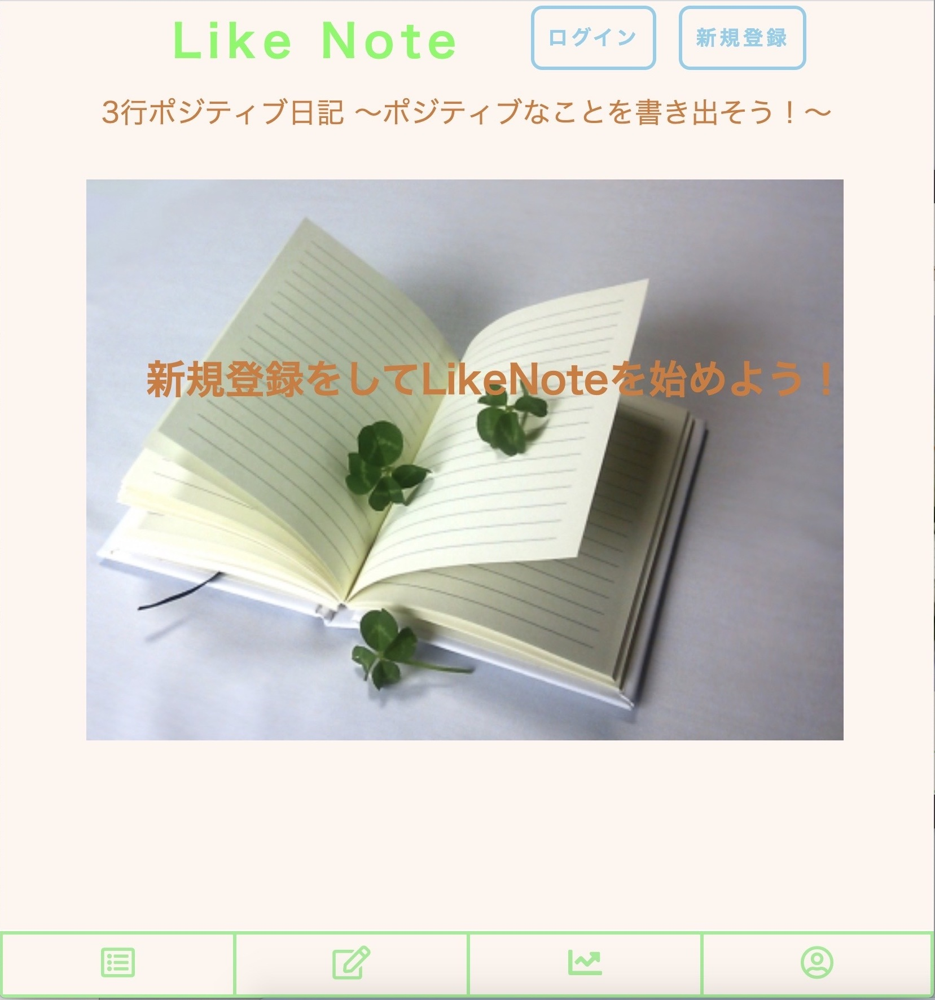
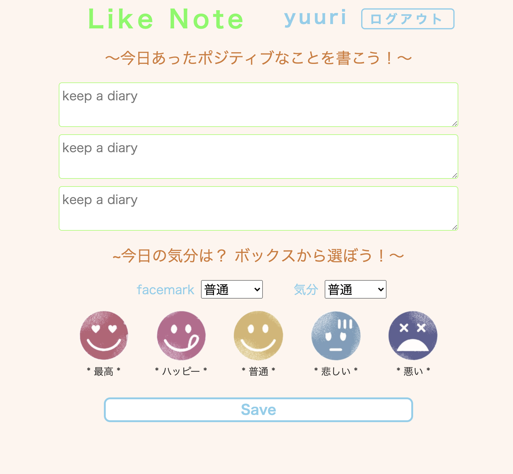
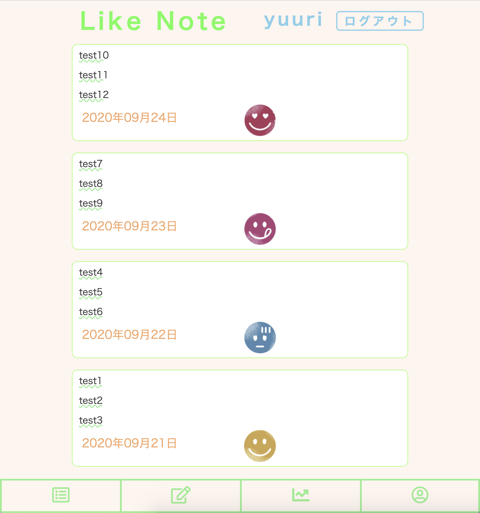
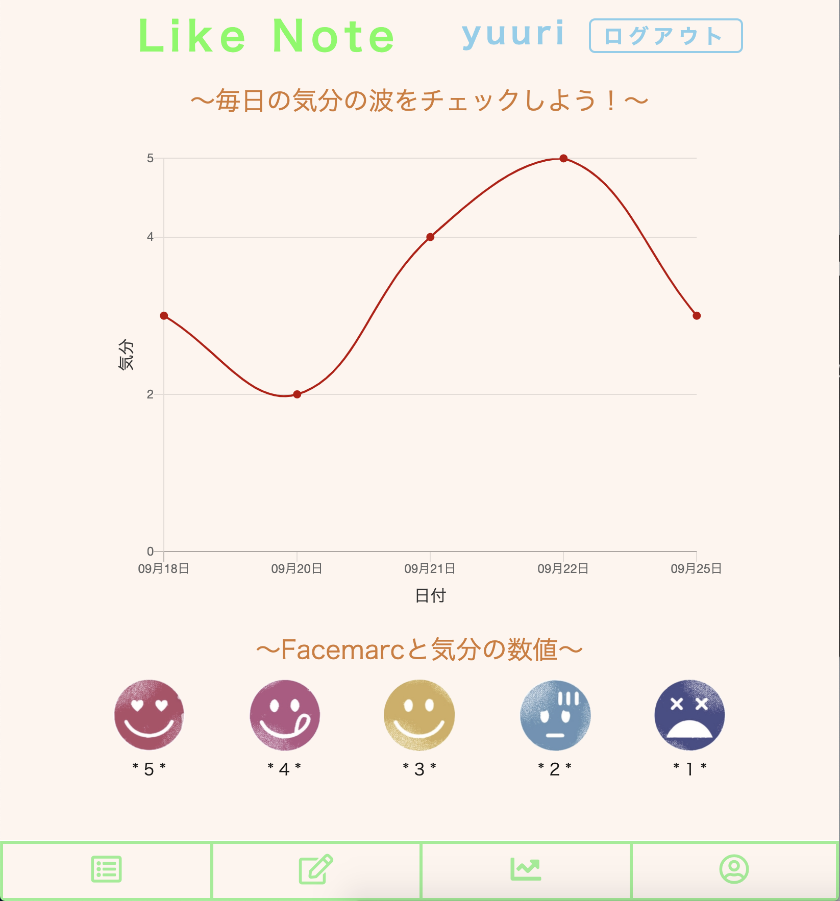

# Like Note
### 「ポジティブ思考を手に入れて、自分を好になろう」をコンセプトに作成したポジティブ3行日記アプリ

  

# 概要

### ポジティブな出来事を日記として書き留めていくことが、ポジティブ思考に繋がります。

精神科医で作家の樺沢紫苑先生が提唱しているポジティブ三行日記のアプリ版です。
今日あったポジティブな出来事３つとその日の気分を記録する日記のようなアプリです。
気分はフェスマークで表現し、日付別に気分の波をグラフとして見ることも可能です。

# App URL
 https://like-note.herokuapp.com/
 
# 利用方法
1.トップページから新規登録・ログインをします。  
  
2.左から２つ目のアイコンをクリックし投稿画面に遷移します。  
  
3.3つの文章記入欄に文章を記入し、二箇所の気分選択欄で同じ気分を選択します。  
  
  
  
4.投稿すると、投稿一覧とグラフが更新されます。  
  
### 投稿一覧画面  
  
    
  
### グラフ画面  
  
    
  
# 機能一覧
|機能|概要|
|------|----|
|ユーザー管理機能|新規登録・ログイン・ログアウト|
|日記投稿機能|3つの文章とフェイスマーク（気分）の投稿が可能|
|日記一覧機能|投稿した日記が一覧表示される|
|グラフ機能|投稿したフェイスマーク（気分）をグラフ化|
|ユーザー詳細表示機能|ユーザー情報を確認できる|

# 追加予定機能
### 投稿一覧、グラフをユーザーごとに区別すること  

# DB設計

## usersテーブル
|Column|Type|Options|
|------|----|-------|
|email|string|null: false|
|password|string|null: false|
|name|string|null: false|
### Association
- has_many :messages

## messagesテーブル
|Column|Type|Options|
|------|----|-------|
|text1|text|null: false|
|text2|text|null: false|
|text3|text|null: false|
|image|string|null: false|
|user_id|integer|null: false, foreign_key: true|
### Association
- belongs_to :user
- has_one :mood

## moodsテーブル
|Column|Type|Options|
|------|----|-------|
|status|string|null: false|
|message_id|integer|null: false, foreign_key: true|
### Association
- belongs_to :message
